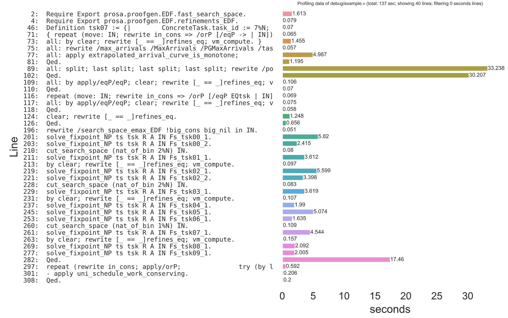

# coqprofiler

A simple profiler for Coq `.v` files. Uses the `-time` parameter of `coqc` to gather data and plots the results.
It can output the plots in `.pdf` format or show them on screen. 

## Requirements

```
pip3 install matplotlib seaborn pandas
```
## Usage
- `./coqprofiler.py example/example.v`  
  - Use as you would use `coqc`: you can pass `coqc` parameters to the profiler.
- If necessary, tweak `config.py` file to change preferences
- Type `make example` and check the `example/` folder to test



